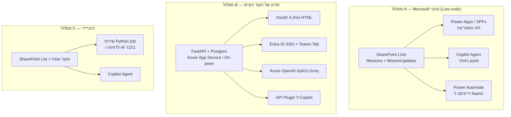

# חדר מבצעים בתוך ה-Worksite הארגוני (M365 + Copilot) — תוכנית עבודה

**סטטוס:** טיוטה לדיון. שלב 1 = ללא טלגרם בכלל.
**מקור:** העתקה של `חדר מבצעים` מ-Shan-AI (FastAPI + Postgres + Groq) לסביבה הארגונית.

---

## 1. מה בדיוק מעתיקים — מלאי הפיצ'רים הקיים

מקור האמת בקוד: `app/routers/war_room.py`, `app/services/missions_menu_service.py`,
`app/services/missions_report_service.py`, `app/services/war_room_styles.py`, `app/models.py`.

| # | יכולת | היכן בקוד היום | שלב 1? |
|---|-------|----------------|--------|
| 1 | ישות משימה (Eisenhower: דחוף × חשוב) | `models.Mission` | כן |
| 2 | יומן עדכוני סטטוס (append-only, שם כותב כ-snapshot) | `models.MissionUpdate` | כן |
| 3 | 4 תצוגות לוח: מטריצה / פוקוס / מסך-קיר / טבלה | `war_room_styles.STYLES` | חלקי (2 תצוגות) |
| 4 | העדפת תצוגה per-user + `?style=` לעקיפה | `users.war_room_style` | לא (שלב 2) |
| 5 | פעולות: יצירה, שינוי סטטוס, הערה, הזזת רביע, הקצאת אחראי, שינוי יעד | `war_room.py` POST endpoints | כן |
| 6 | פעולות באצווה (bulk) | `POST /bulk` | לא (שלב 2) |
| 7 | הרשאת VIEWER = צפייה בלבד | `_require_editor` | כן |
| 8 | דוח XLSX + תובנות AI + קאש יומי (prewarm 04:10 + watchdog) | `missions_report_service` | שלב 4 |
| 9 | תקציר "פוקוס" יומי ב-AI | `build_focus_summary` | שלב 3 |
| 10 | דייג'סט 07:00 + התראות פיגור | טלגרם | **מחוץ לשלב 1** |
| 11 | ניהול משימות מתוך צ'אט (בוט) | `telegram_polling.py` | **מחוץ לשלב 1** — יוחלף ב-Copilot |

> הערה: מה שהופך את חדר המבצעים לשימושי הוא לא הלוח, אלא #2 + #5 (יומן עדכונים חי) ו-#8/#9 (AI שקורא את הכל ומסכם). לוח יפה בלי יומן עדכונים הוא Excel עם צבעים.

---

## 2. שלוש ארכיטקטורות אפשריות בסביבה הארגונית

| קריטריון | A — Low-code | B — פורט קוד | C — היברידי |
|---|---|---|---|
| זמן לפיילוט אמיתי | ~2–3 שבועות | ~6–10 שבועות (רובם אישורי אבטחה) | ~4–6 שבועות |
| אישורי IT/סייבר | נמוך — הכל בתוך ה-tenant | **גבוה** — שרת, DB, פורט נכנס | בינוני |
| ניצול הקוד הקיים | ~0% (רק הלוגיקה כמפרט) | ~85% | ~40% (דוחות + AI) |
| שילוב Copilot | טבעי (תוכן מאונדקס ב-Graph) | דורש API Plugin + auth | טבעי |
| תלות בשן-AI הקיים | אין | גבוהה | חלקית |
| סיכון עיקרי | תקרת יכולת ב-Power Apps (מטריצה, drag&drop) | הפרויקט ימות בוועדת אבטחה | שני עולמות לתחזק |

**המלצה:** **מסלול A לשלב 1**, עם שמירה על מסלול C כמוצא (הנתונים ממילא יושבים ב-SharePoint, אז מעבר ל-C זה תוספת ולא כתיבה מחדש).
הנימוק הברוטלי: בחברת חשמל, הצוואר-בקבוק אינו הקוד אלא האישור. מסלול B מבקש שרת, DB ופורט — זה חודשים. מסלול A מבקש רשימה באתר SharePoint קיים — זה ימים.

---

## 3. מודל הנתונים ב-SharePoint (מיפוי 1:1 מהמודל הקיים)

### רשימה `Missions`

| עמודה ב-SharePoint | סוג | מקור ב-`models.Mission` | הערות |
|---|---|---|---|
| `Title` | Text (255) | `title` | חובה |
| `Description` | Multi-line (plain) | `description` | |
| `IsUrgent` | Yes/No | `is_urgent` | ברירת מחדל: לא |
| `IsImportant` | Yes/No | `is_important` | ברירת מחדל: לא |
| `MissionStatus` | Choice: `open` / `done` / `cancelled` | `status` | **לא** להשתמש בשם `Status` (מתנגש ב-SP) |
| `Owner` | Person | `owner_id` | |
| `Author` (built-in) | Person | `created_by_id` | |
| `DueDate` | Date only | `due_date` | תאריך ישראלי, בלי שעה |
| `CompletedAt` | DateTime | `completed_at` | |
| `Quadrant` | Calculated (מ-IsUrgent/IsImportant) | `quadrant_key()` | קיים כדי ש-Copilot וה-Views יקראו טקסט ולא בוליאנים |
| `OverdueNotifiedAt` | DateTime | `overdue_notified_at` | שלב 4 בלבד |

### רשימה `MissionUpdates`

| עמודה | סוג | מקור | הערות |
|---|---|---|---|
| `Title` | Text | — | 100 תווים ראשונים של העדכון (SP דורש Title) |
| `MissionRef` | Lookup → Missions | `mission_id` | |
| `UpdateText` | Multi-line | `text` | |
| `Kind` | Choice: `update` / `close` | `kind` | |
| `AuthorName` | Text | `author_name` | **snapshot בכוונה** — מחיקת משתמש לא תמחק מי דיווח מה |
| `Created` (built-in) | DateTime | `created_at` | |

**כלל שמור מהמערכת הקיימת:** `MissionUpdates` היא append-only. אין עריכה ואין מחיקה — רק הוספה. זה מה שהופך את הלוח לראיה ניהולית ולא לרשימת מטלות.

### הרשאות

| תפקיד ב-Shan-AI | מקבילה ב-SharePoint |
|---|---|
| `VIEWER` | Read על האתר/הרשימה |
| מנהל פרויקט / מחלקה | Contribute |
| מנהל אגף / סגן | Contribute + Owner של ה-Views |
| אדמין | Site Owner |

---

## 4. תוכנית שלבים

### שלב 0 — בדיקת היתכנות בטננט (לפני שכותבים שורה אחת)
יש לוודא מול IT, ובכתב:
1. האם קיים רישוי **M365 Copilot** (ולכמה משתמשים)?
2. האם מותר ליצור **Power Apps / Power Automate** ב-tenant, ומי מאשר?
3. האם קיים רישוי **Copilot Studio** (סוכן מותאם) או רק Copilot Chat?
4. מי הבעלים של אתר ה-Worksite ומי יכול ליצור בו רשימות?
5. סיווג המידע — האם תוכן משימות (פרויקטים, ספקים, תקלות) מותר בענן ה-M365 של החברה?

**ללא תשובה חיובית ל-2 ו-4, מסלול A מת ויש לחזור למסלול B/C.**

### שלב 1 — הליבה (ללא טלגרם, ללא AI)
- שתי רשימות + עמודות כמפורט בסעיף 3.
- 4 Views מוכנים: *הכול פעיל*, *המשימות שלי*, *באיחור*, *סגורות*.
- דף לוח: Power App מוטמע בעמוד באתר, מטריצת 2×2 (4 גלריות מסוננות לפי `Quadrant`).
- פעולות: יצירה, עדכון (מוסיף שורה ל-`MissionUpdates`), סגירה (מחייבת הערת סגירה — כמו היום), הזזת רביע, הקצאה, שינוי יעד.
- **קריטריון סיום:** 10 משימות אמיתיות שלך רצות שבוע במערכת, בלי אקסל מקביל.

### שלב 2 — תצוגות ונוחות
- תצוגת "פוקוס" (מובייל) + תצוגת מסך-קיר לחדר הישיבות.
- פעולות באצווה, העדפת תצוגה למשתמש.

### שלב 3 — שכבת Copilot
- **סוכן מוצהר (Declarative Agent)** בשם "חדר מבצעים", מעוגן לאתר ה-Worksite.
- Instructions בעברית: הסבר מה זה רביע, מה נחשב באיחור, איך לענות (בנקודות, קצר).
- ספריית פרומפטים מוכנה: "מה באיחור אצלי", "סכם לי את השבוע של אגף התכנון", "אילו משימות לא זזו 14 יום".
- **אזהרת אמינות:** עיגון Copilot על **פריטי רשימה** אינו חזק כמו עיגון על מסמכים. יש לבדוק זאת אמפירית בשלב 0/3, ואם התוצאה חלשה — לייצר קובץ סיכום יומי (MD/XLSX) בספריית מסמכים, ולעגן את הסוכן עליו. זו הסיבה שקיים fallback במסלול C.

### שלב 4 — אוטומציה ודוחות (מחליף את הטלגרם)
- Power Automate: דייג'סט 07:00 ל-**Teams/Outlook** במקום טלגרם.
- התראת פיגור עם `OverdueNotifiedAt` כדי למנוע כפילויות (בדיוק הלוגיקה הקיימת).
- דוח XLSX + תובנות AI — או ב-Power Automate, או ע"י פורט של `missions_report_service.py` למסלול C.

---

## 5. מה **לא** מעתיקים, ולמה

1. **טלגרם** — הוחלט: מחוץ לשלב 1.
2. **Groq** — לא יעבור סינון ארגוני. מחליף: M365 Copilot / Azure OpenAI.
3. **login.py / users** — מוחלף ב-Entra ID. אין לנהל סיסמאות בתוך הכלי.
4. **pgvector / RAG** — לא נדרש לחדר מבצעים. זה חלק אחר של Shan-AI.

---

## 6. סיכונים

| סיכון | חומרה | מענה |
|---|---|---|
| Power Platform חסום ב-tenant | קריטי | שלב 0 שאלה 2; אחרת מסלול B |
| Copilot לא באמת "רואה" פריטי רשימה | גבוה | קובץ סיכום יומי בספריית מסמכים כעוגן |
| הלוח ננטש כי אין תזכורות (אין טלגרם) | גבוה | להביא את שלב 4 מוקדם ככל האפשר, או Teams Adaptive Card ידני בינתיים |
| כפילות מול Shan-AI הקיים | בינוני | להחליט מראש: הארגוני הוא מקור האמת לעבודה, שן-AI נשאר מעבדה |

---

## 7. הצעד הבא

לשלוח מייל אחד ל-IT עם 5 השאלות של שלב 0 (סעיף 4), ובמקביל לפתוח רשימת SharePoint ניסיונית באתר קיים שאתה כבר Owner בו — אם יצירת הרשימה עוברת, מסלול A חי.
