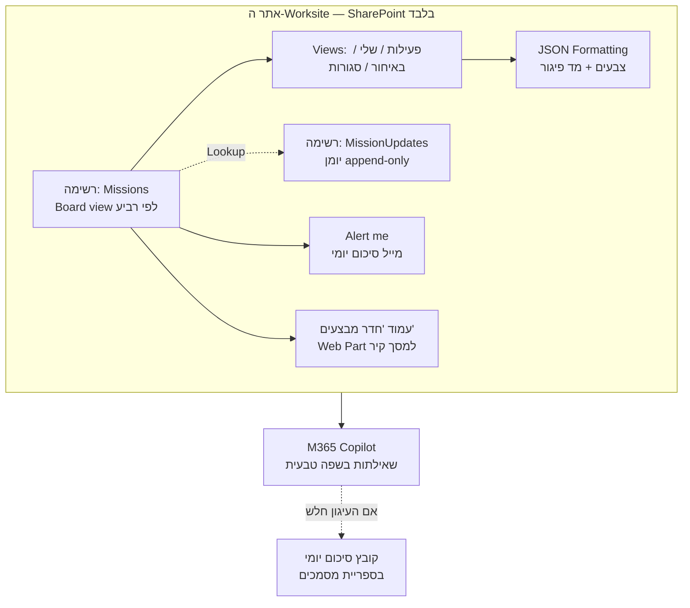

# חדר מבצעים בתוך ה-Worksite הארגוני (SharePoint + Copilot) — תוכנית עבודה

**סטטוס:** תוכנית מאושרת לשלב 1. עודכן אחרי החלטת האילוץ: **רשימות SharePoint בלבד — ללא Power Apps / Power Automate.**
**שלב 1 = ללא טלגרם בכלל.**
**מקור:** העתקה של `חדר מבצעים` מ-Shan-AI (FastAPI + Postgres + Groq) לסביבה הארגונית.

---

## 1. מה בדיוק מעתיקים — מלאי הפיצ'רים הקיים

מקור האמת בקוד: `app/routers/war_room.py`, `app/services/missions_menu_service.py`,
`app/services/missions_report_service.py`, `app/services/war_room_styles.py`, `app/models.py`.

| # | יכולת | היכן בקוד היום | האם שורדת ב-SharePoint נטו? |
|---|-------|----------------|------------------------------|
| 1 | ישות משימה (Eisenhower: דחוף × חשוב) | `models.Mission` | ✅ מלא |
| 2 | יומן עדכוני סטטוס (append-only, שם כותב כ-snapshot) | `models.MissionUpdate` | ⚠️ חלקי — ראה סעיף 4 |
| 3 | 4 תצוגות לוח (מטריצה / פוקוס / קיר / טבלה) | `war_room_styles.STYLES` | ✅ 3 מתוך 4 כ-Views |
| 4 | העדפת תצוגה per-user | `users.war_room_style` | ❌ אין — כל אחד בוחר View ידנית |
| 5 | פעולות: יצירה, סטטוס, הערה, הזזת רביע, הקצאה, שינוי יעד | POST endpoints | ✅ מלא (הזזת רביע = גרירה ב-Board view) |
| 6 | פעולות באצווה | `POST /bulk` | ✅ "עריכה בתצוגת רשת" |
| 7 | הרשאת VIEWER = צפייה בלבד | `_require_editor` | ✅ הרשאת Read |
| 8 | דוח XLSX | `missions_report_service` | ✅ "ייצוא ל-Excel" מובנה |
| 9 | תובנות AI + תקציר פוקוס | `get_ai_insights`, `build_focus_summary` | ⚠️ רק דרך Copilot — ראה סעיף 6 |
| 10 | דייג'סט 07:00 + התראות פיגור | טלגרם | ⚠️ מוחלף ב-Alerts של SharePoint |
| 11 | ניהול מתוך צ'אט (בוט) | `telegram_polling.py` | ❌ מחוץ לשלב 1 |

> מה שהופך את חדר המבצעים לשימושי הוא לא הלוח, אלא **#2** (יומן עדכונים חי) ו-**#9** (AI שקורא הכול ומסכם). לוח בלי יומן עדכונים = אקסל עם צבעים. שני אלה הם בדיוק שתי נקודות התורפה במסלול ללא Power Platform — לכן הן מטופלות בנפרד בסעיפים 4 ו-6.

---

## 2. הארכיטקטורה הנבחרת — "מסלול A-lite" (SharePoint נטו)



**למה זה נבחר:** הצוואר-בקבוק בחברת חשמל אינו הקוד אלא האישור. יצירת רשימה באתר שאתה כבר Owner בו = היום. Power Apps = ועדה. שרת + DB = חודשים.
**המחיר:** מוותרים על UI מותאם, על העדפות משתמש ועל אוטומציה אמיתית. זו החלטה מודעת לשלב 1, לא הצלחה.

**מסלולי המשך (לא לשלב 1):**
- **B** — פורט של הקוד הקיים ל-Azure/on-prem עם Entra ID. ניצול ~85% מהקוד, אבל דורש אישור אבטחה לשרת ולפורט נכנס.
- **C** — היברידי: הרשימות נשארות מקור האמת, ושירות Python קטן קורא אותן דרך Graph ומייצר את דוח ה-XLSX ותובנות ה-AI.

הבחירה בין B ל-C תיעשה **אחרי** הפיילוט, על בסיס נתוני שימוש אמיתיים — לא לפניו. זה גם מה שיצדיק את בקשת התקציב/האישור.

---

## 3. מודל הנתונים — רשימת `Missions`

> **גוצ'ה קריטי:** SharePoint גוזר את ה-*internal name* מהשם שבו נוצרה העמודה. עמודה שנוצרת בשם עברי מקבלת internal name מסוג `_x05e9__x05dd_` — סיוט לכל אוטומציה, Graph API או Copilot עתידי. **צור כל עמודה בשם אנגלי, ורק אחר כך שנה את שם התצוגה לעברית.**

| שם ליצירה (אנגלי) | שם תצוגה | סוג | מקור ב-`models.Mission` | הערות |
|---|---|---|---|---|
| `Title` | משימה | Text | `title` | חובה |
| `Description` | תיאור | Multi-line, plain | `description` | |
| `Quadrant` | רביע | **Choice** (4 ערכים) | `is_urgent`+`is_important` | ראה למטה — זהו מקור האמת |
| `MissionStatus` | סטטוס | Choice: `פעילה` / `בוצעה` / `בוטלה` | `status` | **אסור** לקרוא לה `Status` — מתנגש ב-SP |
| `Owner` | אחראי | Person | `owner_id` | |
| `DueDate` | יעד | Date only | `due_date` | בלי שעה |
| `ClosingNote` | הערת סגירה | **Text (255)** | `MissionUpdate.kind='close'` | **חייב Single-line** — ראה סעיף 5 |
| `CompletedAt` | נסגרה בתאריך | Date | `completed_at` | |
| `IsUrgent` / `IsImportant` | דחוף / חשוב | Calculated (Yes/No) מתוך `Quadrant` | `is_urgent`, `is_important` | לתאימות עם המודל בקוד ולייצוא |
| `Author` / `Created` / `Modified` | מובנות | — | `created_by_id`, `created_at`, `updated_at` | לא ליצור ידנית |

### ערכי `Quadrant`
```
🔴 דחוף וחשוב
🟡 חשוב לא דחוף
🔵 דחוף לא חשוב
⚪ לא דחוף ולא חשוב
```

**למה Choice ולא שתי עמודות Yes/No כמו בקוד?** כי `Board view` של SharePoint יודע לקבץ **רק** לפי Choice או Person, ורק אז מקבלים **גרירה בין עמודות** — כלומר בדיוק ה-endpoint `POST /{id}/move` שקיים היום, בחינם וללא קוד. שתי עמודות בוליאניות היו הורגות את הפיצ'ר הכי טוב בלוח.
עמודות `IsUrgent`/`IsImportant` המחושבות שומרות על התאימות למודל הקיים כדי שסנכרון עתידי (מסלול C) לא ידרוש מיפוי מחדש.

---

## 4. יומן העדכונים — נקודת התורפה מספר 1

היום `MissionUpdates` הוא append-only עם snapshot של שם הכותב, כדי שמחיקת משתמש לא תמחק מי דיווח מה. ב-SharePoint נטו יש שלוש דרכים, וכולן פשרה:

| # | שיטה | יתרון | חיסרון | פסק דין |
|---|------|-------|--------|---------|
| 1 | רשימה נפרדת `MissionUpdates` + עמודת Lookup ל-Missions | מודל זהה למקור, ניתן לייצוא, נראה ל-Copilot | המשתמש צריך לבחור את המשימה ידנית בטופס — חיכוך אמיתי | **נבחר** |
| 2 | עמודת Multi-line עם `Append Changes to Existing Text` | חוויית עדכון מושלמת: תיבה אחת בכרטיס המשימה, SP רושם מי ומתי | דורש הפעלת Versioning; מוצג ב-rendering ישן; **לא נגיש כמעט לייצוא, לחיפוש ול-Copilot** | גיבוי |
| 3 | Comments מובנים על פריט הרשימה | אפס הקמה | לא ניתן לייצוא, לא נכנס ל-Views, עיגון Copilot לא ודאי | נדחה |

**החלטה:** רשימה נפרדת (#1), עם `AuthorName` כעמודת Text בנוסף לעמודת ה-Person — בדיוק מאותה סיבה שהיא קיימת בקוד היום.

**סעיף לאימות (לא לנחש):** האם ניתן לפתוח את טופס `MissionUpdates/NewForm.aspx` עם המשימה כבר מלאה מראש, דרך פרמטרים ב-URL, ולתלות את הקישור הזה ככפתור בכל שורה ב-JSON Formatting. אם כן — החיכוך של #1 נעלם והוא עדיף בבירור. **זה לא מאומת ואין להתייחס לזה כעובדה עד שנבדק בפועל.** אם לא — הפשרה היא כפתור "הוסף עדכון" גלובלי בראש הלוח.

### רשימת `MissionUpdates`
| שם ליצירה | שם תצוגה | סוג | מקור |
|---|---|---|---|
| `Title` | תמצית | Text | 100 תווים ראשונים |
| `MissionRef` | משימה | Lookup → Missions | `mission_id` |
| `UpdateText` | עדכון | Multi-line | `text` |
| `Kind` | סוג | Choice: `עדכון` / `סגירה` | `kind` |
| `AuthorName` | מדווח | Text (snapshot) | `author_name` |

---

## 5. חוקים עסקיים שכן אפשר לאכוף ללא קוד

1. **סגירת משימה מחייבת הערת סגירה** — Validation ברמת הרשימה:
   `=IF([סטטוס]="בוצעה", LEN([הערת סגירה])>0, TRUE)`
   **גוצ'ה:** נוסחאות Validation ו-Calculated ב-SharePoint **אינן יכולות להתייחס לעמודות Multi-line**. לכן `ClosingNote` מוגדרת Single-line 255 ולא Multi-line. זו הסיבה היחידה.
2. **יעד לא בעבר בעת יצירה** — `=[יעד]>=TODAY()` (שקול; אולי מציק מדי בפועל).
3. **צביעת פיגור** — JSON Column Formatting על `DueDate`: אדום כאשר התאריך עבר והסטטוס `פעילה`. זה מחליף את `is_overdue()` שבקוד.

---

## 6. שכבת ה-Copilot — נקודת התורפה מספר 2

**מה שידוע:** תוכן SharePoint מאונדקס ל-Microsoft Graph, ו-M365 Copilot נשען עליו.
**מה שלא ידוע ואסור להניח:** עד כמה העיגון על **פריטי רשימה** (להבדיל ממסמכים) באמת אמין ומדויק. הניסיון הרווח הוא שמסמכים עובדים הרבה יותר טוב מפריטי רשימה.

**לכן — בדיקה אמפירית לפני שבונים משהו מעליה.** 5 שאלות מבחן, אחרי שיש 20 משימות אמיתיות ברשימה:
1. "אילו משימות באיחור באגף?"
2. "מה מצב המשימות של [שם עובד]?"
3. "אילו משימות ברביע 'דחוף וחשוב' לא עודכנו שבועיים?"
4. "סכם לי את השבוע בחדר המבצעים."
5. "כמה משימות נסגרו החודש ולמה?"

| תוצאה | מסקנה |
|---|---|
| 4–5 תשובות נכונות | Copilot הוא שכבת ה-AI. אין צורך בשום דבר נוסף בשלב 1. |
| 2–3 | להוסיף עמודות טקסט "ידידותיות ל-AI" (רביע כטקסט, "ימים באיחור" מחושב) ולבדוק שוב. |
| 0–1 | **תוכנית הגיבוי:** קובץ סיכום יומי (Markdown/XLSX) בספריית מסמכים באתר, שעליו מעגנים את Copilot. מי מייצר אותו — זו בדיוק ההצדקה למסלול C. |

---

## 7. תוכנית שלבים

| שלב | תוכן | תלוי במישהו? | קריטריון סיום |
|---|---|---|---|
| **1** | שתי רשימות, עמודות, Views, Validation, JSON formatting | לא — אתה לבד | 10 משימות אמיתיות שלך רצות שבוע, בלי אקסל מקביל |
| **2** | עמוד "חדר מבצעים" באתר + מסך קיר + `Alert me` יומי לכל אחראי | לא | 3 ראשי מחלקות מעדכנים בעצמם, לא אתה |
| **3** | מבחן ה-5 שאלות של Copilot + עמודות ידידותיות ל-AI | רישוי Copilot | ציון מבחן מתועד |
| **4** | הרחבה: 500 עובדי האגף, או החלטה על מסלול B/C | IT / תקציב | Business case מבוסס נתוני שימוש אמיתיים |

**מה שנשאר חסר ואין לו פתרון ללא Power Automate:** דייג'סט 07:00 מנוסח, התראת פיגור חד-פעמית עם `overdue_notified_at` (מניעת כפילויות), ותובנות AI אוטומטיות. `Alert me` של SharePoint שולח סיכום יומי גולמי — הוא לא תחליף, הוא מטלית.

---

## 8. מה **לא** מעתיקים, ולמה

1. **טלגרם** — החלטה שלך, מחוץ לשלב 1.
2. **Groq** — לא יעבור סינון ארגוני. מחליף: M365 Copilot.
3. **login.py / טבלת users** — מוחלף ב-Entra ID. אין לנהל סיסמאות בכלי ארגוני.
4. **pgvector / RAG** — לא רלוונטי לחדר מבצעים; זה חלק אחר של Shan-AI.

---

## 9. סיכונים

| סיכון | חומרה | מענה |
|---|---|---|
| Copilot לא באמת "רואה" פריטי רשימה | גבוה | מבחן 5 השאלות + קובץ סיכום יומי כגיבוי |
| הלוח ננטש כי אין תזכורות פרואקטיביות | **גבוה — זה הסיכון האמיתי** | `Alert me` בשלב 2 + ריטואל שבועי קבוע בישיבת האגף |
| חיכוך בהוספת עדכון (סעיף 4) הורג את יומן העדכונים | גבוה | לאמת את הקישור המקדים; אחרת כפתור גלובלי |
| כפילות מול Shan-AI הקיים | בינוני | להחליט מראש: הרשימה הארגונית = מקור האמת לעבודה. Shan-AI נשאר מעבדה. |
| נעילה: 500 עובדים על רשימת SharePoint | בינוני | מגבלת ה-5,000 פריטים בתצוגה — לתכנן Views מסוננים מהיום הראשון |

---

## 10. הצעד הבא

לפתוח באתר SharePoint שאתה כבר Owner בו רשימה בשם `Missions`, ליצור בה את 6 העמודות הראשונות מסעיף 3 **בשמות אנגליים**, להגדיר `Board view` מקובץ לפי `Quadrant`, ולהזין 5 משימות אמיתיות משולחנך. אם הגרירה בין הרביעים עובדת — שלב 1 מאושר טכנית ואפשר להמשיך לרשימת העדכונים.
